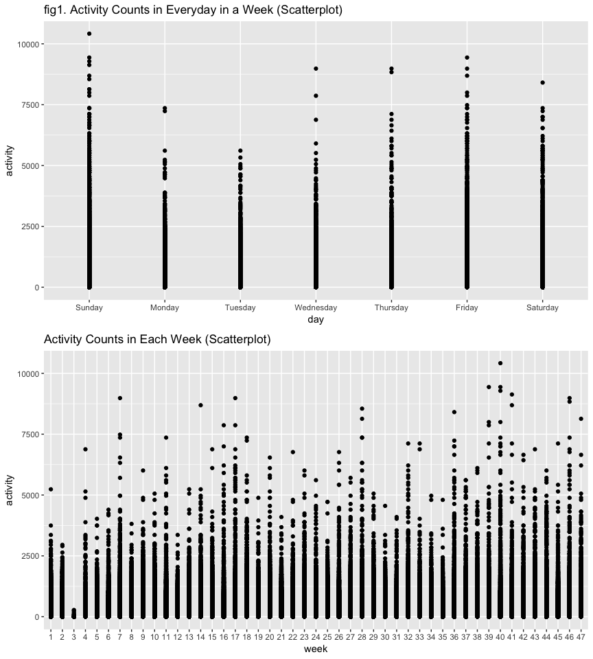

p8105\_mtp\_zf2211
================
Francis
10/23/2018

``` r
#load packages
library(tidyverse)
```

    ## ── Attaching packages ──────────────────────────────────────────────────────────────────────── tidyverse 1.2.1 ──

    ## ✔ ggplot2 3.0.0     ✔ purrr   0.2.5
    ## ✔ tibble  1.4.2     ✔ dplyr   0.7.7
    ## ✔ tidyr   0.8.1     ✔ stringr 1.3.1
    ## ✔ readr   1.1.1     ✔ forcats 0.3.0

    ## ── Conflicts ─────────────────────────────────────────────────────────────────────────── tidyverse_conflicts() ──
    ## ✖ dplyr::filter() masks stats::filter()
    ## ✖ dplyr::lag()    masks stats::lag()

``` r
library(ggridges)
```

    ## 
    ## Attaching package: 'ggridges'

    ## The following object is masked from 'package:ggplot2':
    ## 
    ##     scale_discrete_manual

``` r
library(gridExtra)
```

    ## 
    ## Attaching package: 'gridExtra'

    ## The following object is masked from 'package:dplyr':
    ## 
    ##     combine

``` r
#load data
atvy <- read.csv("./data/p8105_mtp_data.csv") %>% 
  janitor::clean_names()
#the size of original table
nrow(atvy)
```

    ## [1] 329

``` r
ncol(atvy)
```

    ## [1] 1442

``` r
# Define normal order of weekdays
atvy$day <- factor(atvy$day, levels = c("Sunday", "Monday", "Tuesday", "Wednesday", "Thursday", "Friday", "Saturday"))
atvy$week <- as.factor(atvy$week)
#tidy data
atvy_tidy <- 
  atvy %>%
  gather(key = minute, value = activity, activity_1:activity_1440) %>% 
  arrange(week, day)
#extract minute number
atvy_tidy$minute <- as.numeric(substr(atvy_tidy$minute, 10, 13))
# add a column to show hour
atvy_tidy <- 
  atvy_tidy %>% 
  mutate(hour = ceiling(minute / 60)) 
```

From the Data, one minute epoch are common, which means only when the activity in cells == 1 it is normal. When the activity counts are too high, the man would have been physical execrising. The dataset after tidy have 5 variables: `week` `day` `minute` `activity` `hour`and 473760 observations.

``` r
a <- ggplot(atvy_tidy, aes(x = day, y = activity)) +
  labs (title = "fig1. Activity Counts in Everyday in a Week (Scatterplot)") +
  geom_point()
b <- ggplot(atvy_tidy, aes(x = week, y = activity)) +
  labs (title = "Activity Counts in Each Week (Scatterplot)") +
  geom_point()
grid.arrange(a, b, nrow = 2)
```



fig 1. From scatterplot above, activity counts(ACs) are relatively lower on Monday and Tuesday. In this year, outliers are: 1(&gt;10000) on Sunday, 2(~7500) on Monday, 3(~7000, ~8000, ~9000) on Wednesday, 2(~9000) on Thursday, 1(~8000) on Saturday. Which is to say, in a week, the activity decrease from Sunday to Monday, then increase from Tuesday to Wednesday and keep to Saturday.

From scatteplot below, we can see ACs are lowered to 0 on 3rd week. Outliers are on week: 1st(&gt;5000), 4th(~7000), 7th(~8000), 11th(~7500), 14th(~9000), 22nd(~7000), 30th(~4500), 33rd(~7500`*`2), 34th(~5000`*`2), 35th(~5000), 36th(~9000), 38th(~6000), 39th(~9500), 41st(~9000`*`2), 42nd(~6000`*`2), 43rd(~7000), 45th(~7000), 46th(~9000\*2), 47(~8000). We also can see the trend that as the week goes, the activity count is increasing steadily.

``` r
#create total activity variable
atvy$total <- rowSums(atvy[, 3:1442])
atvy_total <- select(atvy, week, day, total) %>% arrange(week, day)
atvy_total
```

    ##     week       day     total
    ## 1      1    Sunday 196937.00
    ## 2      1    Monday 432751.00
    ## 3      1   Tuesday 297427.00
    ## 4      1 Wednesday 369436.00
    ## 5      1  Thursday 366178.00
    ## 6      1    Friday 416166.00
    ## 7      1  Saturday   1440.00
    ## 8      2    Sunday   1440.00
    ## 9      2    Monday 275175.00
    ## 10     2   Tuesday 293202.00
    ## 11     2 Wednesday 346427.00
    ## 12     2  Thursday 345305.00
    ## 13     2    Friday 387242.00
    ## 14     2  Saturday   1492.00
    ## 15     3    Sunday   1440.00
    ## 16     3    Monday   2538.00
    ## 17     3   Tuesday   1461.00
    ## 18     3 Wednesday   1440.00
    ## 19     3  Thursday   1440.00
    ## 20     3    Friday   1440.00
    ## 21     3  Saturday   1461.00
    ## 22     4    Sunday 305142.00
    ## 23     4    Monday   1440.00
    ## 24     4   Tuesday   1471.00
    ## 25     4 Wednesday   1440.00
    ## 26     4  Thursday   1440.00
    ## 27     4    Friday   1440.00
    ## 28     4  Saturday 227146.00
    ## 29     5    Sunday 248315.00
    ## 30     5    Monday 219933.00
    ## 31     5   Tuesday 290021.00
    ## 32     5 Wednesday 199567.00
    ## 33     5  Thursday 400639.00
    ## 34     5    Friday 353313.96
    ## 35     5  Saturday 249699.00
    ## 36     6    Sunday 498658.00
    ## 37     6    Monday 301690.00
    ## 38     6   Tuesday 275162.00
    ## 39     6 Wednesday 237971.00
    ## 40     6  Thursday 239461.00
    ## 41     6    Friday 394172.00
    ## 42     6  Saturday 368429.00
    ## 43     7    Sunday 431081.00
    ## 44     7    Monday 360463.00
    ## 45     7   Tuesday 325226.00
    ## 46     7 Wednesday 322627.00
    ## 47     7  Thursday 289168.00
    ## 48     7    Friday 509056.00
    ## 49     7  Saturday  39174.00
    ## 50     8    Sunday 365416.00
    ## 51     8    Monday 515468.00
    ## 52     8   Tuesday 261121.00
    ## 53     8 Wednesday 317183.00
    ## 54     8  Thursday 402661.00
    ## 55     8    Friday   1440.00
    ## 56     8  Saturday 246895.00
    ## 57     9    Sunday 433397.00
    ## 58     9    Monday 356867.00
    ## 59     9   Tuesday 349750.00
    ## 60     9 Wednesday 259808.00
    ## 61     9  Thursday 293287.00
    ## 62     9    Friday 511905.80
    ## 63     9  Saturday 445239.00
    ## 64    10    Sunday 359297.00
    ## 65    10    Monday 477736.00
    ## 66    10   Tuesday 275121.00
    ## 67    10 Wednesday 359277.00
    ## 68    10  Thursday 464580.00
    ## 69    10    Friday 186965.00
    ## 70    10  Saturday 362996.00
    ## 71    11    Sunday 563756.00
    ## 72    11    Monday 249257.00
    ## 73    11   Tuesday 270026.00
    ## 74    11 Wednesday 408556.00
    ## 75    11  Thursday 424893.00
    ## 76    11    Friday 233096.00
    ## 77    11  Saturday 366538.00
    ## 78    12    Sunday   1440.00
    ## 79    12    Monday 332853.00
    ## 80    12   Tuesday 367593.00
    ## 81    12 Wednesday  29863.00
    ## 82    12  Thursday   1461.00
    ## 83    12    Friday   1440.00
    ## 84    12  Saturday   1440.00
    ## 85    13    Sunday 384338.00
    ## 86    13    Monday   1440.00
    ## 87    13   Tuesday  26888.00
    ## 88    13 Wednesday 428252.00
    ## 89    13  Thursday 155329.00
    ## 90    13    Friday 573815.00
    ## 91    13  Saturday 430128.00
    ## 92    14    Sunday 243973.00
    ## 93    14    Monday 304161.00
    ## 94    14   Tuesday 442706.00
    ## 95    14 Wednesday 350373.00
    ## 96    14  Thursday 429883.00
    ## 97    14    Friday 432295.00
    ## 98    14  Saturday 551022.00
    ## 99    15    Sunday   1450.00
    ## 100   15    Monday 512443.00
    ## 101   15   Tuesday 182650.00
    ## 102   15 Wednesday 346626.00
    ## 103   15  Thursday 402759.00
    ## 104   15    Friday 609303.00
    ## 105   15  Saturday 316686.00
    ## 106   16    Sunday 631105.00
    ## 107   16    Monday  78828.07
    ## 108   16   Tuesday 307094.24
    ## 109   16 Wednesday 340115.01
    ## 110   16  Thursday 355923.64
    ## 111   16    Friday 480542.62
    ## 112   16  Saturday 376254.00
    ## 113   17    Sunday 422018.00
    ## 114   17    Monday 295431.00
    ## 115   17   Tuesday 423245.00
    ## 116   17 Wednesday 440962.00
    ## 117   17  Thursday 474048.00
    ## 118   17    Friday 568839.00
    ## 119   17  Saturday 607175.00
    ## 120   18    Sunday 467052.00
    ## 121   18    Monday 685910.00
    ## 122   18   Tuesday 381507.00
    ## 123   18 Wednesday 468869.00
    ## 124   18  Thursday 371230.00
    ## 125   18    Friday 467420.00
    ## 126   18  Saturday 382928.00
    ## 127   19    Sunday 260617.00
    ## 128   19    Monday 409450.00
    ## 129   19   Tuesday 319568.00
    ## 130   19 Wednesday 434460.00
    ## 131   19  Thursday 340291.00
    ## 132   19    Friday 154049.00
    ## 133   19  Saturday   1440.00
    ## 134   20    Sunday 138421.00
    ## 135   20    Monday 389080.00
    ## 136   20   Tuesday 367824.00
    ## 137   20 Wednesday 445366.00
    ## 138   20  Thursday 549658.00
    ## 139   20    Friday 620860.00
    ## 140   20  Saturday   1440.00
    ## 141   21    Sunday 416922.00
    ## 142   21    Monday   3105.00
    ## 143   21   Tuesday 344080.00
    ## 144   21 Wednesday 297998.00
    ## 145   21  Thursday 311294.00
    ## 146   21    Friday 379790.00
    ## 147   21  Saturday 432448.00
    ## 148   22    Sunday 421672.00
    ## 149   22    Monday 366044.00
    ## 150   22   Tuesday 484064.00
    ## 151   22 Wednesday 280019.00
    ## 152   22  Thursday 266186.00
    ## 153   22    Friday 281515.20
    ## 154   22  Saturday 389790.00
    ## 155   23    Sunday 343688.00
    ## 156   23    Monday 341608.00
    ## 157   23   Tuesday 257414.00
    ## 158   23 Wednesday 409169.00
    ## 159   23  Thursday 389014.00
    ## 160   23    Friday 583806.00
    ## 161   23  Saturday 325443.00
    ## 162   24    Sunday 448753.00
    ## 163   24    Monday 332444.00
    ## 164   24   Tuesday 362728.00
    ## 165   24 Wednesday 346681.00
    ## 166   24  Thursday 344537.00
    ## 167   24    Friday 213525.00
    ## 168   24  Saturday 265892.00
    ## 169   25    Sunday 258122.00
    ## 170   25    Monday 400821.00
    ## 171   25   Tuesday 385257.00
    ## 172   25 Wednesday 431625.00
    ## 173   25  Thursday 464825.00
    ## 174   25    Friday 404821.00
    ## 175   25  Saturday 296166.00
    ## 176   26    Sunday 291640.00
    ## 177   26    Monday 328343.00
    ## 178   26   Tuesday 370420.00
    ## 179   26 Wednesday 329598.00
    ## 180   26  Thursday 296381.00
    ## 181   26    Friday 479525.00
    ## 182   26  Saturday 372850.00
    ## 183   27    Sunday 623108.00
    ## 184   27    Monday 356500.00
    ## 185   27   Tuesday 150351.00
    ## 186   27 Wednesday 280132.00
    ## 187   27  Thursday 400248.00
    ## 188   27    Friday 369987.00
    ## 189   27  Saturday 505063.00
    ## 190   28    Sunday 549114.00
    ## 191   28    Monday 399862.00
    ## 192   28   Tuesday 333834.00
    ## 193   28 Wednesday 431353.43
    ## 194   28  Thursday 397789.00
    ## 195   28    Friday 106947.00
    ## 196   28  Saturday 551879.00
    ## 197   29    Sunday 266642.00
    ## 198   29    Monday 329758.00
    ## 199   29   Tuesday 407704.00
    ## 200   29 Wednesday 414577.00
    ## 201   29  Thursday 312692.00
    ## 202   29    Friday 423350.00
    ## 203   29  Saturday 339290.00
    ## 204   30    Sunday  35027.00
    ## 205   30    Monday 252041.00
    ## 206   30   Tuesday 268453.00
    ## 207   30 Wednesday 445909.00
    ## 208   30  Thursday 386978.00
    ## 209   30    Friday 570858.00
    ## 210   30  Saturday 417263.00
    ## 211   31    Sunday   1460.00
    ## 212   31    Monday  15418.00
    ## 213   31   Tuesday 271958.00
    ## 214   31 Wednesday 438713.00
    ## 215   31  Thursday 351348.00
    ## 216   31    Friday 287639.00
    ## 217   31  Saturday 314160.00
    ## 218   32    Sunday 537741.00
    ## 219   32    Monday   1440.00
    ## 220   32   Tuesday  80545.00
    ## 221   32 Wednesday 448752.00
    ## 222   32  Thursday 548850.00
    ## 223   32    Friday 403160.00
    ## 224   32  Saturday 688292.00
    ## 225   33    Sunday 335670.00
    ## 226   33    Monday 278136.00
    ## 227   33   Tuesday 370979.00
    ## 228   33 Wednesday 325627.00
    ## 229   33  Thursday 313515.00
    ## 230   33    Friday 341056.00
    ## 231   33  Saturday 516772.00
    ## 232   34    Sunday 356882.70
    ## 233   34    Monday 357467.00
    ## 234   34   Tuesday 292285.00
    ## 235   34 Wednesday 309192.00
    ## 236   34  Thursday 352808.00
    ## 237   34    Friday 359836.00
    ## 238   34  Saturday 417977.00
    ## 239   35    Sunday 359104.00
    ## 240   35    Monday 317299.85
    ## 241   35   Tuesday 307094.24
    ## 242   35 Wednesday 340115.01
    ## 243   35  Thursday 355923.64
    ## 244   35    Friday 377829.59
    ## 245   35  Saturday 494969.00
    ## 246   36    Sunday 342021.00
    ## 247   36    Monday 341907.00
    ## 248   36   Tuesday 550800.00
    ## 249   36 Wednesday 376773.00
    ## 250   36  Thursday 521950.00
    ## 251   36    Friday 511740.00
    ## 252   36  Saturday 533913.00
    ## 253   37    Sunday 351679.00
    ## 254   37    Monday 410266.00
    ## 255   37   Tuesday 211237.00
    ## 256   37 Wednesday 449263.00
    ## 257   37  Thursday 466645.00
    ## 258   37    Friday 495291.00
    ## 259   37  Saturday 805355.00
    ## 260   38    Sunday 580120.00
    ## 261   38    Monday 374246.00
    ## 262   38   Tuesday 290694.00
    ## 263   38 Wednesday 380319.00
    ## 264   38  Thursday 374976.00
    ## 265   38    Friday 445772.00
    ## 266   38  Saturday 377845.00
    ## 267   39    Sunday 476431.00
    ## 268   39    Monday 423145.00
    ## 269   39   Tuesday 278781.00
    ## 270   39 Wednesday 306512.00
    ## 271   39  Thursday 378711.00
    ## 272   39    Friday 455773.00
    ## 273   39  Saturday 328932.00
    ## 274   40    Sunday 686292.00
    ## 275   40    Monday 343254.00
    ## 276   40   Tuesday 496007.00
    ## 277   40 Wednesday 275619.00
    ## 278   40  Thursday 338463.00
    ## 279   40    Friday 310537.00
    ## 280   40  Saturday 581131.00
    ## 281   41    Sunday 408368.00
    ## 282   41    Monday 385957.00
    ## 283   41   Tuesday 400389.00
    ## 284   41 Wednesday 391782.00
    ## 285   41  Thursday 499367.00
    ## 286   41    Friday 475014.57
    ## 287   41  Saturday 293267.00
    ## 288   42    Sunday 513951.00
    ## 289   42    Monday 347164.00
    ## 290   42   Tuesday 319020.00
    ## 291   42 Wednesday 241651.00
    ## 292   42  Thursday 443590.00
    ## 293   42    Friday 438560.00
    ## 294   42  Saturday 375048.00
    ## 295   43    Sunday 505180.00
    ## 296   43    Monday 437236.00
    ## 297   43   Tuesday 428848.00
    ## 298   43 Wednesday 337897.00
    ## 299   43  Thursday 399464.00
    ## 300   43    Friday 593075.00
    ## 301   43  Saturday 395650.00
    ## 302   44    Sunday 323616.00
    ## 303   44    Monday 327806.00
    ## 304   44   Tuesday 355567.00
    ## 305   44 Wednesday 423119.00
    ## 306   44  Thursday 385552.00
    ## 307   44    Friday 690814.00
    ## 308   44  Saturday 432967.00
    ## 309   45    Sunday 500562.00
    ## 310   45    Monday 321428.00
    ## 311   45   Tuesday 336721.00
    ## 312   45 Wednesday 385638.00
    ## 313   45  Thursday 335858.00
    ## 314   45    Friday 416699.00
    ## 315   45  Saturday 421595.00
    ## 316   46    Sunday 456658.00
    ## 317   46    Monday 535480.00
    ## 318   46   Tuesday 169347.00
    ## 319   46 Wednesday 458865.00
    ## 320   46  Thursday 471725.00
    ## 321   46    Friday 627679.00
    ## 322   46  Saturday 378824.00
    ## 323   47    Sunday 554427.00
    ## 324   47    Monday 382003.00
    ## 325   47   Tuesday 449789.00
    ## 326   47 Wednesday 319889.00
    ## 327   47  Thursday 310087.00
    ## 328   47    Friday 375470.00
    ## 329   47  Saturday 344898.00

Here, variable `total` is the total activity variable of daily activity.

``` r
#show distribution of activity in a week
ggplot(atvy_tidy, aes(x = activity, y = day)) + 
  labs(title = "fig2. Activity Counts in Everyday in a Week (Ridgeplot)") +
  geom_density_ridges()
```

    ## Picking joint bandwidth of 24.4


Over the everyday in a week, most of the activity are around `1`. On Tuesday, Wednesday and Thursday, There are small aggregation on the right of `1`. Which means on these three days, the ACs are increased to some extent. That is to say, activity increases from Monday to Tuesday, and decreases from Thursday to Friday.

``` r
#change factor into numeric
atvy_total$week <- as.numeric(atvy_total$week) 
#take a look at the trend of ACs in each day over the week
ggplot(atvy_total, aes(x = week, y = total, color = day)) +
  labs(title = "fig3. Trend of Activity Count in days of a Week") +
  geom_point(alpha = .7) +
  geom_smooth(method = "lm", se = FALSE)
```

 From fig3, all 7 days in a week, the slope rate of trend lines are positive, which means the participant is getting more active. And from Sunday to Monday, the slope decreases, and from Tuesday through Saturday the slope increases, showing that day of week affects activity.

``` r
#show activity distribution weekly in a year
ggplot(atvy_tidy, aes(x = activity, y = week)) + 
  labs(title = "fig4. Activity Counts in Each Week (Ridges Gradient plot)") +
  geom_density_ridges_gradient()
```

    ## Picking joint bandwidth of 36.8


In each week, ACs are aggregated around `1`. Observe carefully, from 1 to 47 week, the peak of `1` is decreasing, in other words, the higher ACs are increasing. Especially, in 16th and 35th week, there are obvious peak other than at `1` to the right, which shows ACs is increasing. That is to say, the participant became more active over time.

``` r
#Split into 5 group to show daily trend of ACs
a_week1 <-  atvy_tidy %>% filter(week == 1:10)
a_week2 <-  atvy_tidy %>% filter(week == 11:20)
a_week3 <-  atvy_tidy %>% filter(week == 21:30)
a_week4 <-  atvy_tidy %>% filter(week == 31:40)
a_week5 <-  atvy_tidy %>% filter(week == 41:47)
w1 = ggplot(a_week1, aes(x = hour, y = activity, color = week)) + 
  labs (title = "fig5. Daily Activity Count Trend") +
  stat_smooth(se = FALSE)
w2 = ggplot(a_week2, aes(x = hour, y = activity, color = week)) + 
  stat_smooth(se = FALSE)
w3 = ggplot(a_week3, aes(x = hour, y = activity, color = week)) + 
  stat_smooth(se = FALSE)
w4 = ggplot(a_week4, aes(x = hour, y = activity, color = week)) + 
  stat_smooth(se = FALSE)
w5 = ggplot(a_week5, aes(x = hour, y = activity, color = week)) + 
  stat_smooth(se = FALSE)
grid.arrange(w1, w2, w3, w4, w5, nrow = 5)
```

    ## `geom_smooth()` using method = 'gam' and formula 'y ~ s(x, bs = "cs")'
    ## `geom_smooth()` using method = 'gam' and formula 'y ~ s(x, bs = "cs")'
    ## `geom_smooth()` using method = 'gam' and formula 'y ~ s(x, bs = "cs")'
    ## `geom_smooth()` using method = 'gam' and formula 'y ~ s(x, bs = "cs")'
    ## `geom_smooth()` using method = 'gam' and formula 'y ~ s(x, bs = "cs")'


We can see activity count trend in a whole 24h in each week, AC rises in the morning, and grow to a high plateau and extend for about 10 hours and goes down to near `1`. Which overlaps the sleep-awake rhythm. We can see there are a flat curve in 12th week and even a level line in 3rd week. Maybe these are fault data like the accelerometer defect.

``` r
#check word count
wordcountaddin::text_stats("p8105_mtp_zf2211.Rmd")
```

| Method          | koRpus      | stringi       |
|:----------------|:------------|:--------------|
| Word count      | 464         | 387           |
| Character count | 2483        | 2482          |
| Sentence count  | 28          | Not available |
| Reading time    | 2.3 minutes | 1.9 minutes   |
