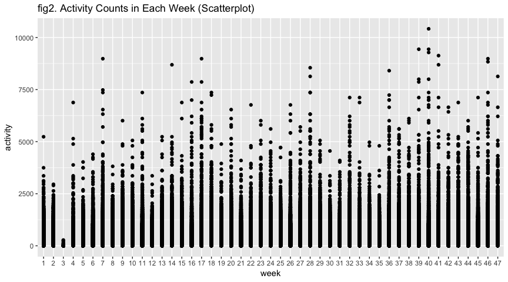

p8105\_mtp\_zf2211
================
Francis
10/23/2018

``` r
library(tidyverse)
```

    ## ── Attaching packages ──────────────────────────────────────────────────────────────────────── tidyverse 1.2.1 ──

    ## ✔ ggplot2 3.0.0     ✔ purrr   0.2.5
    ## ✔ tibble  1.4.2     ✔ dplyr   0.7.7
    ## ✔ tidyr   0.8.1     ✔ stringr 1.3.1
    ## ✔ readr   1.1.1     ✔ forcats 0.3.0

    ## ── Conflicts ─────────────────────────────────────────────────────────────────────────── tidyverse_conflicts() ──
    ## ✖ dplyr::filter() masks stats::filter()
    ## ✖ dplyr::lag()    masks stats::lag()

``` r
library(ggridges)
```

    ## 
    ## Attaching package: 'ggridges'

    ## The following object is masked from 'package:ggplot2':
    ## 
    ##     scale_discrete_manual

``` r
#load data
atvy <- read.csv("./data/p8105_mtp_data.csv") %>% 
  janitor::clean_names()
nrow(atvy)
```

    ## [1] 329

``` r
ncol(atvy)
```

    ## [1] 1442

``` r
# Define normal order of weekdays
atvy$day <- factor(atvy$day, levels = c("Sunday", "Monday", "Tuesday", "Wednesday", "Thursday", "Friday", "Saturday"))
#tidy the table
atvy_tidy <- 
  atvy %>%
  gather(key = minute, value = activity, activity_1:activity_1440) %>% 
  arrange(week, day)
nrow(atvy_tidy)
```

    ## [1] 473760

``` r
ncol(atvy_tidy)
```

    ## [1] 4

From the Data, one minute epoch are common, which means only when the activity in cells == 1 it is normal. When the activity counts are too high, the man would have been physical execrising. The dataset after tidy have 4 variables: `week` `day` `minute` `activity` and 473760 observations.

``` r
ggplot(atvy_tidy, aes(x = day, y = activity)) +
  geom_point()
```

 From the scatterplot, on

``` r
ggplot(atvy_tidy, aes(x = week, y = activity)) + 
  geom_density_2d()
```



``` r
ggplot(atvy_tidy, aes(x = activity, y = day, fill = day, height = ..density..)) +
  geom_density_ridges(scale = 4, stat = "density") +
  scale_y_discrete(expand = c(0.01, 0)) +
  scale_x_continuous(expand = c(0.01, 0)) +
  scale_fill_brewer(palette = 4) + 
  theme_ridges() + 
  theme(legend.position = "none")
```


``` r
#count daily average activity countshhh
atvy_tidy %>% 
  filter(activity > 1000) %>% 
  count() / nrow(atvy_tidy)
```

    ##            n
    ## 1 0.05537192

``` r
#count word numbers
wordcountaddin::text_stats("p8105_mtp_zf2211.Rmd")
```

| Method          | koRpus      | stringi       |
|:----------------|:------------|:--------------|
| Word count      | 52          | 49            |
| Character count | 316         | 315           |
| Sentence count  | 4           | Not available |
| Reading time    | 0.3 minutes | 0.2 minutes   |
